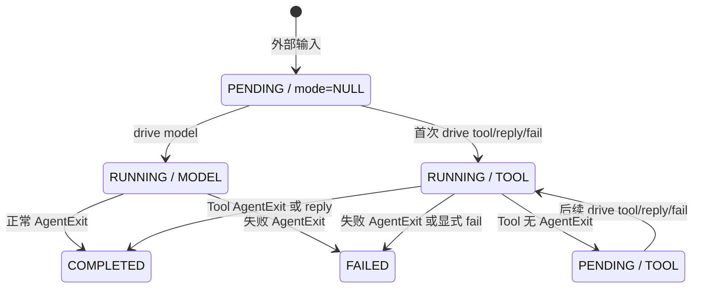

# AgentPlaneX 介入契约

## 命令与前置条件

| 命令 | 前置条件 | 主要结果 |
|---|---|---|
| `message <内容>` | 没有未完成 Activation 或活动 StageRun | 写入 `USER_INPUT` message，创建 Activation。 |
| `approve` | `pending_action=PLAN_APPROVAL` | 提交 Spec，写入 `PLAN_DECISION` message，创建 Activation。 |
| `reject <原因>` | `pending_action=PLAN_APPROVAL` | 保留反馈并创建 `PLAN_DECISION` Activation。 |
| `start` | `pending_action=FIRST_RUN_APPROVAL`，Owner 和 Delivery 均空闲 | 开始首次 Run，入队首个 StageRun。 |
| `drive-delivery` | Owner 空闲，存在可 claim 的 StageRun | 执行一个 Stage；终态结果会创建 `EXECUTION_RESULT` Activation。 |
| `view` | 无 | 返回组合后的 Runtime Context、Snapshot、StageRun、Activation、Timeline 和 Git 事实。 |
| 裸 Tool Action JSON | 没有未完成 Activation | 独立验证一个真实 Tool；不代表一次 Owner ReAct loop。 |
| `drive model` | 存在尚未绑定模式的待处理 Activation | 由真实 Project Owner 模型消费整个 Activation。 |
| `drive tool <JSON>` | 存在新的或已经绑定 `TOOL` 的待处理 Activation | 原子执行一个手动 Tool step，并持久化 Action/Observation。 |
| `drive reply <内容>` | 存在可由 Tool 模式 claim 的 Activation | 写入 assistant reply，以 `ReplyToHuman` 完成 Activation。 |
| `drive fail <原因>` | 存在 Tool 模式 Activation，或要将新 Activation 交给 Tool 模式后失败 | 显式写入失败原因并终结，不回放可能已有副作用的 Tool。 |

`--print` 每次只执行一条命令并退出。跨命令恢复依赖目标项目的 `.agentplanex/agentplanex.sqlite3`，因此每次必须使用同一个明确的 `--cwd`。

## Activation 状态流



驱动模式在首次 claim 时原子绑定，之后不可从 `TOOL` 切换到 `MODEL`，也不可接管正在运行的模型 Activation。`PENDING + TOOL` 表示手动 Owner loop 正在等待下一条显式 Action，不表示新的外部输入。

## Tool 驱动的持久副作用

一次 `drive tool` 按以下顺序执行：

1. 原子 claim Activation，进入 `RUNNING + TOOL`。
2. 在 `message_history` 写入标准 `function_call`。
3. 使用当前 Runtime Context 调用同一个 Project Execution 与 Service。
4. 写入标准 `function_call_output`。
5. Tool 无 `AgentExit` 时释放为 `PENDING + TOOL`；否则终结 Activation。

首次 Tool claim 发布 `REACT_LOOP_ENTERED`，终结时发布 `REACT_LOOP_EXITED`；两者使用 `activation_id` 作为稳定 `react_loop_id`，payload 包含 `driver_mode=TOOL`。Tool 内部产生的计划、Milestone、Stage、Candidate 和 Context 事件会自然关联到同一个 loop。Timeline 是 best-effort 观察记录，不能替代 Activation 与业务表的权威状态。

Tool 已产生副作用而进程尚未来得及写 Observation 时，不要自动重放。先检查 Runtime、Git 和 SQLite 事实，再用 `drive fail` 收敛，或在有明确恢复契约时继续。

## 交付循环中的常见顺序

```text
approve
  -> drive tool update_milestones
  -> drive tool run_next_milestone
  -> start                         # 仅首次 Run
  -> drive-delivery                # 每次最多一个 Stage
  -> drive tool decide_milestone_candidate
  -> drive tool run_next_milestone # 仍有后续 Milestone 时
```

`update_milestones` 和非最终的 Candidate 决策通常没有 `AgentExit`，因此同一个 Activation 会等待下一条 Tool Action。`run_next_milestone` 会产生首次启动关卡或入队结果并终结当前 Activation。`drive-delivery` 不在 Owner loop 内运行；Stage 终态会通过邮箱唤醒下一次 Owner 处理。

具体 Tool 参数以代码中的 Tool Schema 为准，不要从示例中的 `{...}` 猜测字段。

## 安全边界

- 真实项目上的 `message`、`approve`、`reject`、`start`、Tool、Delivery 与 `fail` 都是状态变更，必须有用户授权。
- 调试优先在可重建的 `.agentplanex/tests/<case>` Git 项目中完成。
- 不持续轮询，不直接修改 SQLite，不手工推进状态，不改写 Candidate/接受分支 ref。
- 本 Skill 只负责受控介入和即时验证，不负责事后因果归因。
