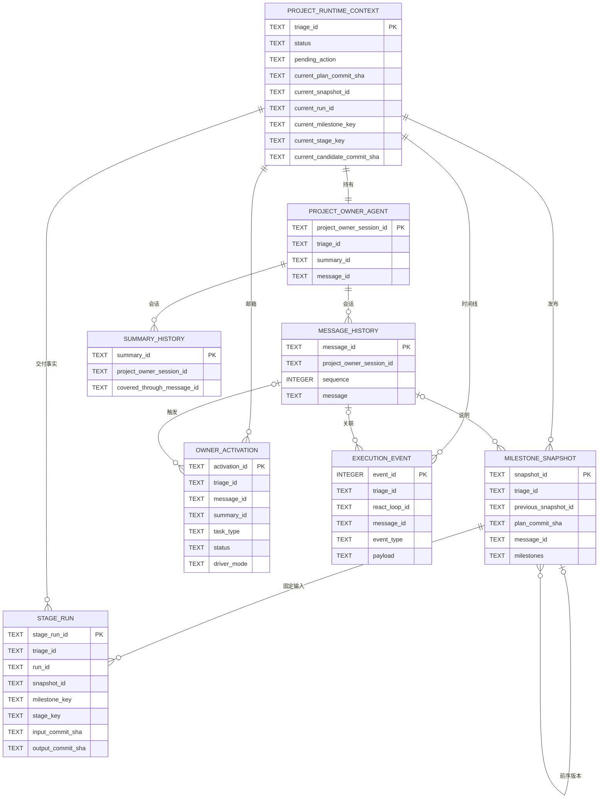

# AgentPlaneX 运行时数据模型

## 目录

1. 权威与访问
2. 逻辑实体关系
3. 数据表词典
4. 状态含义
5. Timeline 含义
6. 各角色的调查起点

## 权威与访问

项目数据库位于 `<project>/.agentplanex/agentplanex.sqlite3`。依赖表结构前先检查 `PRAGMA user_version`；本参考说明的是 schema version 9。

SQLite 和 Git 只能作为只读证据源。不要为了观察项目而初始化 Runtime，不要修改 SQLite、变更 Git ref 或伪造证据文件。

| 要回答的问题 | 权威来源 |
|---|---|
| 项目意图是什么？ | `requirements.md`、`architecture.md`、`roadmap.md` |
| 项目现在在哪里？ | `project_runtime_context` |
| 已发布的是哪个 Milestone View？ | `milestone_snapshot` |
| 某个 Stage 尝试了什么、产出了什么或为何失败？ | `stage_run` 与 Git |
| 某次状态迁移或 Agent Loop 为何发生？ | `execution_event`，再关联 Message 和对象事实 |
| Owner 为什么需要再次运行？ | `owner_activation` |

Timeline 是追加式的观察记录。它不是事件溯源状态机、可靠的调度队列，也不能单独证明某个 Candidate 仍在接受分支上。

## 逻辑实体关系

下图展示逻辑关系。SQLite 没有为这些关系声明外键约束；它们由 Service 的 Runtime Contract 维护。

数据库中没有 Plan、Milestone、Candidate 或 Run 的独立表。它们分别由 Git、不可变 Snapshot JSON、`stage_run.run_id`、Context 指针、Git ref 与 Timeline 事实共同表达。

## 数据表词典

### `project_runtime_context`

这是一个 `triage_id` 的唯一当前状态权威。它的指针字段描述现在，不是历史审计记录。

| 字段 | 含义 |
|---|---|
| `triage_id` | 被开发项目 Runtime 的稳定身份。 |
| `idea` | 已记录时的原始用户想法。 |
| `status` | 当前项目生命周期：`TRIAGE`、`TODO`、`READY`、`IN_PROGRESS`、`BLOCKED` 或 `DONE`。 |
| `pending_action` | 显式人类关卡：`PLAN_APPROVAL`、`FIRST_RUN_APPROVAL` 或 `NULL`。 |
| `git_branch` | 配置的项目接受分支。 |
| `git_main_version` | Runtime 记录的 Git 基准版本；当前 Git 状态须单独验证。 |
| `rolling_started_at` | Rolling Delivery 开始的时间。 |
| `current_plan_commit_sha` | 当前交付所依据的已批准 Plan commit。 |
| `pending_plan_subject_digest` | 正在等待批准的精确 Plan subject digest。 |
| `current_snapshot_id` | 当前完整且不可变的 Milestone View。 |
| `current_run_id` | 当前尚未解决的 Milestone Run；不存在时为 `NULL`。 |
| `current_milestone_key` | 当前 Run 或 Candidate 所选择的 Milestone。 |
| `current_stage_key` | 当前排队或运行中的 Stage；不存在时为 `NULL`。 |
| `current_candidate_commit_sha` | 尚未决定的 Candidate commit；其为空不代表历史 Candidate 被删除。 |

### `milestone_snapshot`

每一行是一个完整且不可变的 Milestone View。计划变化会创建后继行，不会编辑旧 Snapshot。

| 字段 | 含义 |
|---|---|
| `snapshot_id` | 不可变 Snapshot 身份。 |
| `triage_id` | 所属 Runtime。 |
| `previous_snapshot_id` | 版本链中的前一个 Snapshot；首次发布时为 `NULL`。 |
| `plan_commit_sha` | 授权此 View 的已批准 Git Plan commit。 |
| `milestones` | 规范化 JSON 数组；包含有序 Milestone 的 `key`、`objective`、`state` 及其有序 Stage。 |
| `reason` | 发布这个完整 View 的原因。 |
| `message_id` | 促成发布的 Owner message；存在时可反查。 |
| `created_at` | 发布时间。 |

`milestones` 中的 `state=completed` 只能由接受该 Milestone 的 Candidate 产生。Snapshot 本身不能证明 Candidate 仍可从接受分支到达；需要时自行检查 Git。

### `stage_run`

每一行是从一个固定 Git 输入执行一个固定 Stage 的持久事实。相同 `run_id` 的行属于同一次有序 Milestone Run；系统有意不建单独的 Run 表。

| 字段 | 含义 |
|---|---|
| `stage_run_id` | 此次 Stage 尝试的稳定身份。 |
| `triage_id` | 所属 Runtime。 |
| `run_id` | 归并同一 Milestone Candidate 尝试中的多个 Stage。 |
| `snapshot_id` | 选择此 Stage 所依据的不可变 Milestone View。 |
| `milestone_key`、`stage_key` | Snapshot JSON 中固定的对象标识。 |
| `status` | `QUEUED`、`RUNNING`、`SUCCEEDED` 或 `FAILED`。 |
| `input_commit_sha` | Executor 必须从此 commit 开始。 |
| `output_commit_sha` | 成功 Stage 产出的 commit；其他状态为 `NULL`。 |
| `failure` | 终态失败说明；非失败行是 `NULL`。 |
| `created_at` | 入队时间。 |
| `started_at` | 被 claim 的时间；排队时为空。 |
| `lease_expires_at` | 运行时的恢复边界；终态行为空。 |
| `finished_at` | 成功或失败的终态时间；终态前为空。 |

最后一个成功 Stage 的 `output_commit_sha` 是 Candidate commit。Owner 决策前，Runtime 用 `refs/agentplanex/candidates/<run_id>` 保留它。

### `execution_event`

这是 Timeline。它记录可观察的业务事实。`event_id` 只在一个项目内提供单调顺序；不得通过回放事件推导当前状态。

| 字段 | 含义 |
|---|---|
| `event_id` | 单调递增的 Timeline 身份。 |
| `triage_id` | 所属 Runtime。 |
| `event_type` | 见 [Timeline 含义](#timeline-含义) 的事实类别。 |
| `react_loop_id` | 产生该事实或当时处于活动状态的逻辑 Project Owner loop；不适用时为空。 |
| `message_id` | 相关的持久化 Owner message；存在时可反查。 |
| `payload` | 事件专属 JSON 证据，例如对象 ID、commit、原因或失败信息。 |
| `created_at` | 事件创建时间。 |

### `owner_activation`

这是持久化邮箱，不是 Timeline 事件，也不是 Stage 队列。

| 字段 | 含义 |
|---|---|
| `activation_id` | 邮箱条目的稳定身份。 |
| `triage_id` | 所属 Runtime。 |
| `task_type` | `USER_INPUT`、`PLAN_DECISION` 或 `EXECUTION_RESULT`。 |
| `message_id` | Owner 必须消费的持久化 message。 |
| `summary_id` | Activation 入队时冻结的 Summary checkpoint；未使用 Summary 时为空。 |
| `status` | `PENDING`、`RUNNING`、`COMPLETED` 或 `FAILED`。 |
| `driver_mode` | 首次 claim 后固定为 `MODEL` 或 `TOOL`；尚未绑定的新 Activation 为 `NULL`。 |
| `created_at`、`started_at`、`finished_at` | 邮箱生命周期时间。 |
| `failure` | 终态 Activation 失败信息；没有失败时为空。 |

### `project_owner_agent`、`message_history` 和 `summary_history`

这三张表在进程重启后保留同一个逻辑 Owner。

| 表与字段 | 含义 |
|---|---|
| `project_owner_agent.triage_id` | 将唯一 Owner 绑定到 Runtime。 |
| `project_owner_agent.project_owner_session_id` | 稳定的 Owner 对话身份。 |
| `project_owner_agent.system_prompt`、`tools` | 持久化的模型指令和固定 Tool catalog。 |
| `project_owner_agent.summary_id`、`message_id` | 最新保留的 summary 和 message 指针。 |
| `message_history.project_owner_session_id`、`message_id`、`sequence` | 会话归属、message 身份与全序。 |
| `message_history.message` | 持久化的 provider/model message JSON。 |
| `summary_history.project_owner_session_id`、`summary_id` | 会话归属与 summary 身份。 |
| `summary_history.covered_through_message_id` | 已纳入 summary 的最后一条原始 message。 |
| `summary_history.intent_summary_content` | 滚动保留的用户目标、约束、纠正和未决问题。 |
| `summary_history.trajectory_summary_content` | 压缩保留的对话轨迹、工具活动、进度和下一步。 |
| `summary_history.covered_through_message_id` | 双 Summary 已覆盖到的原始 Message watermark。 |

## 状态含义

### 项目 Runtime

`TRIAGE` 是初始探索状态。`TODO` 表示尚未开始 Rolling Delivery：Owner 可以维护和请求批准 Plan，也可以在已有批准 Plan 后发布初始 Milestone View。是否已有批准基线必须检查 `current_plan_commit_sha`，不能仅由状态推断。`READY` 等待首次 Run 的显式批准。`IN_PROGRESS` 表示 Rolling Delivery 正在进行；此时提交新的 Plan 或完整 Milestone View 会自动运行相应 Hard Gate。`BLOCKED` 记录需要 Owner 决策的终态失败，不运行 Hard Gate；若 Plan 与 Snapshot 未变化，可以重新运行第一个未完成 Milestone。`DONE` 表示最终未完成 Milestone 的 Candidate 已被接受。

`pending_action` 独立于描述性的 Timeline 历史。`PLAN_APPROVAL` 表示精确 Plan subject 等待用户决策；只有在 `IN_PROGRESS` 提交时才必然具有 Hard Gate review。`FIRST_RUN_APPROVAL` 表示 Milestone 已发布，但首次 Run 尚未显式开始。

### StageRun 与 Activation

`StageRun` 状态流为 `QUEUED -> RUNNING -> SUCCEEDED|FAILED`。一个 Triage 最多有一个 `QUEUED` 或 `RUNNING` 的 StageRun。运行中行持有 lease；lease 过期时由 Delivery Driver 收敛为失败。

模型驱动的 `OwnerActivation` 状态流为 `PENDING -> RUNNING -> COMPLETED|FAILED`。手动 Tool 驱动会在每条 Action 执行时进入 `RUNNING + TOOL`，无 `AgentExit` 时释放为 `PENDING + TOOL` 等待下一条 Action。`driver_mode` 一经绑定不可切换。Activation 为外部输入或终态交付结果唤醒 Owner，不能被当成 Delivery dispatch 机制。

## Timeline 含义

使用 Timeline 定位事实，再关联对应的行、message 与 Git 对象。由于 Event Bus 的投递是观察性的 best-effort 行为，缺少某个 Timeline 事件并不推翻已经提交的 Runtime 或 Git 事实。

| 事件族 | 事件类型 | 含义与常用 payload |
|---|---|---|
| 项目负责人循环 | `REACT_LOOP_ENTERED`、`REACT_LOOP_EXITED` | 一次项目负责人 Activation 进入或离开 ReAct loop。`react_loop_id` 使用稳定的 `activation_id`；payload 标识 `driver_mode`、`task_type` 或 `agent_exit_status`。 |
| 当前 Context | `RUNTIME_CONTEXT_UPDATED` | 一次已持久化的 Context 变化。payload 有 `reason` 和 `changes`，每个变化包含 `from` 与 `to`。 |
| 外部 Agent | `AGENT_INVOCATION_STARTED`、`AGENT_INVOCATION_COMPLETED`、`AGENT_INVOCATION_FAILED` | Planner/Reviewer A2A、Hard Gate 或 Stage Executor 的调用。payload 含 `invocation_id`、`operation`、相关对象 ID，以及适用时的失败类型。 |
| 计划 | `PLAN_APPROVAL_REQUESTED`、`PLAN_APPROVED`、`PLAN_REJECTED` | Plan 进入审批、带 `plan_commit_sha` 通过审批，或被拒绝。 |
| 里程碑 | `MILESTONES_UPDATED`、`FIRST_RUN_APPROVAL_REQUESTED`、`MILESTONE_RUN_QUEUED` | 完整 Snapshot 被发布、首次人类启动关卡打开，或下一个有序 StageRun 入队。payload 锚定 Snapshot、Milestone、Run 与 Stage。 |
| 阶段 | `STAGE_RUN_STARTED`、`STAGE_RUN_SUCCEEDED`、`STAGE_RUN_FAILED` | Stage 被 claim、终态产出或终态失败。payload 锚定 `stage_run_id`、`run_id`、commit 与失败详情。 |
| 候选提交 | `CANDIDATE_READY`、`CANDIDATE_ACCEPTED`、`CANDIDATE_REJECTED` | 最终 Stage 产生 Candidate，或 Owner 已作决定。payload 标识 Run、Milestone 与 Candidate commit。 |
| 完成 | `TRIAGE_DEVELOPMENT_COMPLETED` | 最终 Candidate 被接受，所有 Milestone 已完成。 |

## 各角色的调查起点

从 Runtime 提供的稳定工作对象开始。可以检查变动中的 Context 了解项目位置，但绝不能用它替换受保护的工作对象。

| 角色 | 起点 | 再检查 |
|---|---|---|
| 执行者 | `stage_run_id` | 对应 Snapshot JSON、`input_commit_sha`、前一 StageRun 输出和固定交付文档路径。 |
| 规划者 | Spec 文件与当前 Plan/Snapshot 标识 | 只有任务确实需要 Plan 变更理由时，才读取 Owner message history。 |
| 硬门控 | `IN_PROGRESS` 受保护操作提供的精确 Plan/完整 Milestone subject digest | 不可变 subject 和证据 artifact；不得决定或修改 Context，也不得在 `TODO`/`BLOCKED` 自行运行。 |
| 审查者 | Candidate SHA 与 `run_id` | 最终 StageRun、全部有序 Stage 输出、Snapshot、交付文档和 Git diff。 |
| 项目负责人 | 当前 Context 与 activation `message_id` | 当前 Snapshot、Candidate/Run 事实，以及与待决策相关的 Timeline 事实。 |
| 调查 Agent | `triage_id`、`event_id`、Run、Snapshot 或 commit | 沿上述逻辑关系遍历，并独立验证 Git 可达性或 diff。 |
