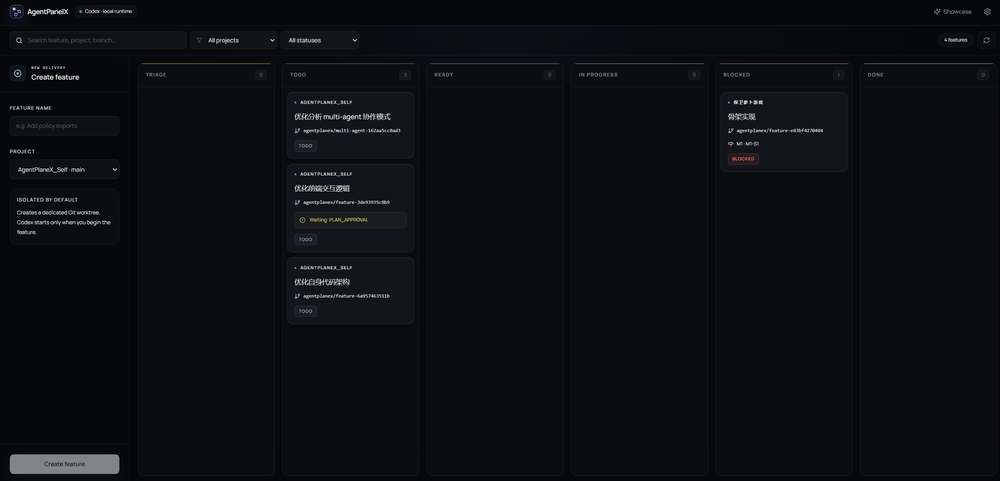
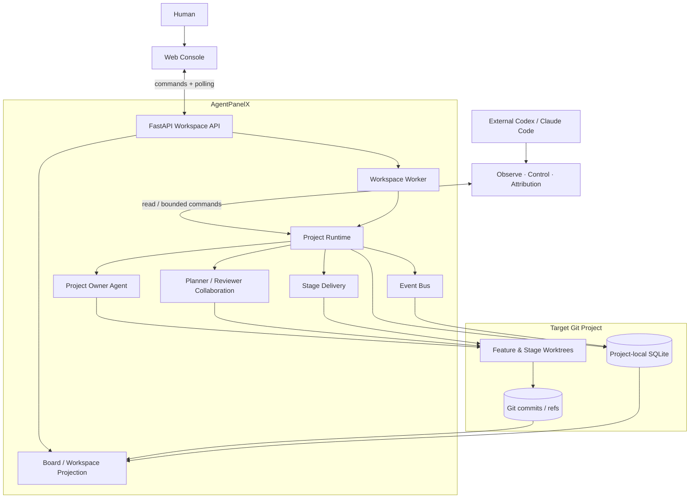

# AgentPanelX

<p align="center">
  
</p>

<h3 align="center">Autonomous Harness Orchestrator</h3>

<p align="center">
  AgentPanelX is a local-first control plane for long-running coding projects.<br />
  A Project Owner agent maintains intent, rolls plans forward, recovers interrupted delivery, and turns execution history into evidence for Harness Evolution.
</p>

<p align="center">
  <a href="https://aowo-1345.github.io/AgentPanelX/"><strong>Website</strong></a>
  ·
  <a href="https://aowo-1345.github.io/AgentPanelX/console"><strong>Try the Console</strong></a>
  ·
  <a href="docs/architecture.md">Architecture</a>
  ·
  <a href="README.zh-CN.md">简体中文</a>
</p>

<p align="center">
  <a href="https://github.com/aowo-1345/AgentPanelX/actions/workflows/ci.yml"></a>
  <a href="LICENSE"></a>
  
  
</p>

## Agent-native onboarding

Already using Codex or Claude Code? Let your coding agent install, verify, and explain AgentPanelX for you.

```text
Install AgentPanelX locally and verify that the Web Console starts. Then explain how
Project Owner, Project Runtime, Git worktrees, and the Observe / Control / Attribution
skills work together. Use the repository documentation as the source of truth and
report missing prerequisites instead of guessing.
```

Open this repository in your coding agent, send the request above, and keep the agent in the repository root. The conventional installation steps are available in [Quick start](#quick-start).



## What AgentPanelX does

That Runtime provides four connected capabilities:

| Capability | What it provides |
| --- | --- |
| **Project Owner rolling delivery** | Maintains user intent and coordinates Planner, Reviewer, and coding agents across Plan, Milestone, and Stage boundaries. |
| **Isolated execution** | Runs each Feature in its own Git branch and worktree so multiple coding agents do not share a working directory. |
| **Observable runtime** | Projects conversations, reasoning, tool input/output, approvals, Git state, Plan, and Timeline into one Web Console. |
| **Recovery and Harness Evolution** | Preserves BLOCKED evidence, reconstructs the failure context, and turns recurring delivery gaps into structured proposals. |

## System context



The Web Console and external coding agents are two interfaces to the same Project Runtime. The browser supports continuous observation and human decisions; repository Skills let Codex or Claude Code recover evidence, execute bounded control actions, and investigate historical failures from the terminal.

## Agent-native operations

The Web Console is the human interface. Three repository Skills expose the same Project Runtime to Codex and other compatible coding agents:

| Skill | Purpose | Boundary |
| --- | --- | --- |
| [Observe](.codex/skills/agentplanex-project-observe/SKILL.md) | Reconstruct Runtime, Plan, Git, Milestone, Stage, and Timeline facts. | Read-only; does not approve or drive execution. |
| [Control](.codex/skills/agentplanex-project-control/SKILL.md) | Send messages, approve or reject plans, start delivery, and drive authorized runtime actions. | Uses the real Runtime; never edits SQLite or Git refs directly. |
| [Attribution](.codex/skills/agentplanex-project-attribution/SKILL.md) | Restore a BLOCKED checkpoint, fork a read-only Historical Project Owner, question its decisions, and produce a Harness Evolution proposal. | Retrospective and read-only; does not resolve the block itself. |

See [Agent-native operations](docs/skills.md) for the complete workflow and permission model.

## Quick start

### Requirements

- Python 3.12
- [`uv`](https://docs.astral.sh/uv/)
- Node.js and npm
- Git
- Bubblewrap (`bwrap`) on Linux
- At least one supported CLI coding agent for real delivery runs

### Install and run

```bash
git clone https://github.com/aowo-1345/AgentPanelX.git
cd AgentPanelX

uv sync
cd frontend && npm ci && npm run build && cd ..

uv run agentplanex-web
```

Open `http://127.0.0.1:13475`.

The FastAPI process serves the React application and the same-origin `/api` from one port. Model credentials are only required for real Project Owner activations; they are read from environment variables declared in [`config/settings.yaml`](config/settings.yaml).

## Architecture

```text
React Web Console
      │ same-origin /api + silent polling
FastAPI Workspace API
      │
WorkspaceService ── WorkspaceWorker
      │
Feature ProjectRuntime
      ├── Project Owner / Planning / Delivery
      ├── EventBus ── Timeline projection
      ├── Git worktree / Plan commits / Candidate refs
      └── project-local SQLite / Messages / Snapshots / Stage runs
```

Each Feature owns a managed worktree and a project-local SQLite runtime. Git and filesystem effects remain separated from business decisions; Plan and Milestone gates validate exact subjects; the EventBus records execution facts without becoming a second source of truth.

Read [Architecture](docs/architecture.md) for component boundaries, message sequencing, delivery contracts, polling projections, and BLOCKED attribution.

## Development

```bash
uv run pytest
uv run ruff check .
uv run mypy

cd frontend
npm run check
npm run lint
npm run build
```

The default test suite does not call a model gateway. See [Contributing](CONTRIBUTING.md) for repository conventions and Project Owner tool debugging.

## Documentation

- [Architecture](docs/architecture.md)
- [Agent-native operations](docs/skills.md)
- [Console walkthrough](docs/showcase.md)
- [Contributing](CONTRIBUTING.md)
- [Security](SECURITY.md)
- [MIT License](LICENSE)
