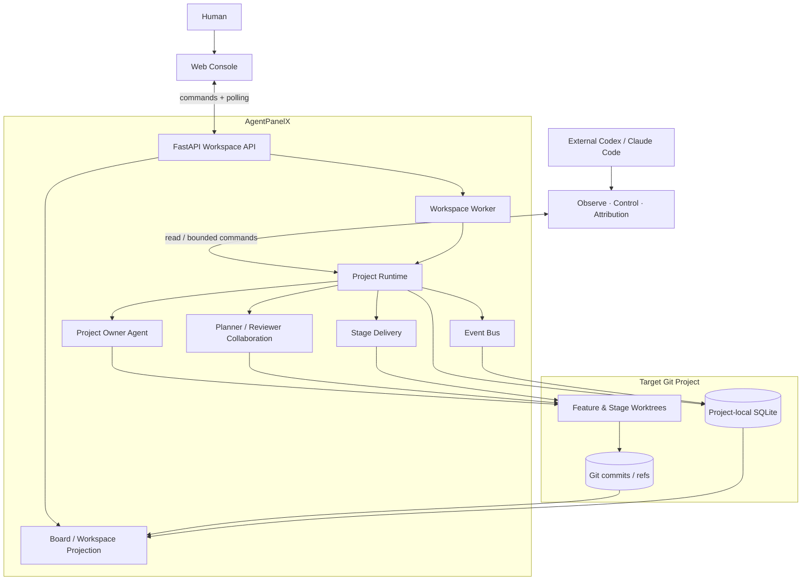
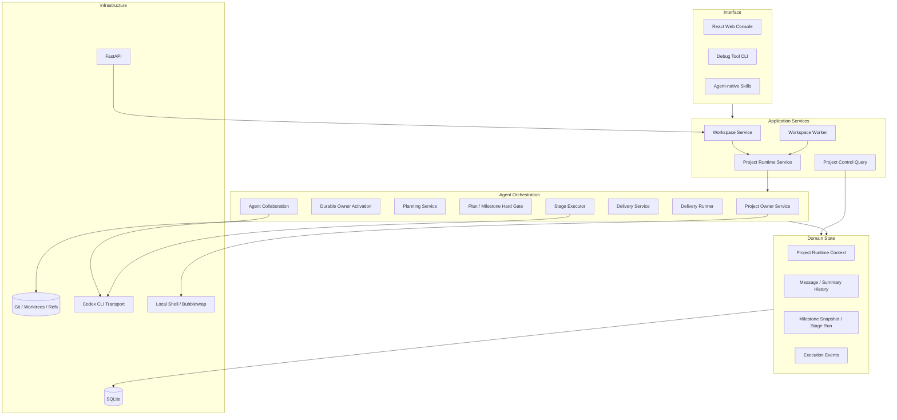
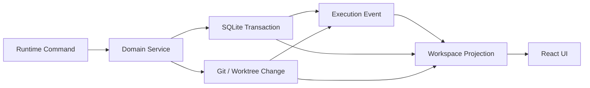
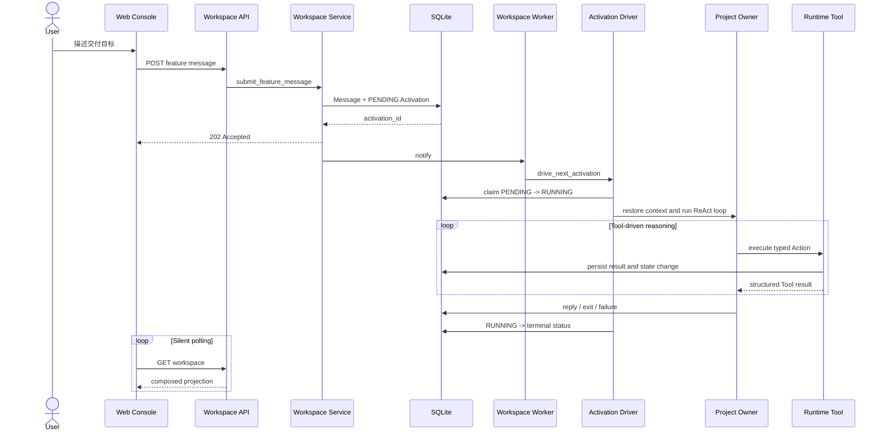
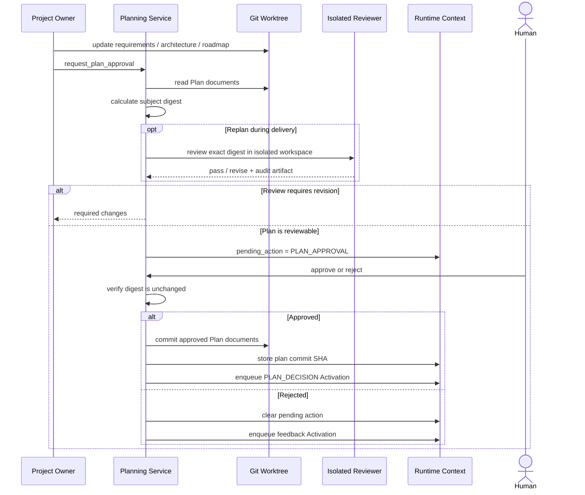
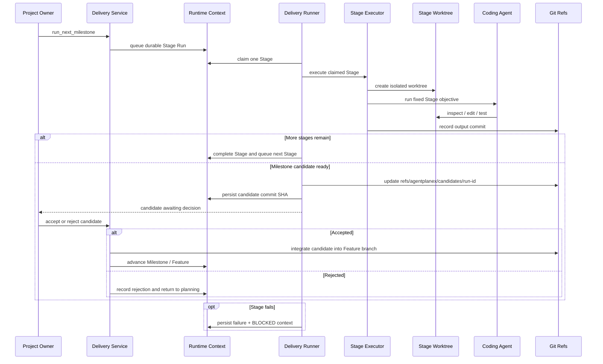
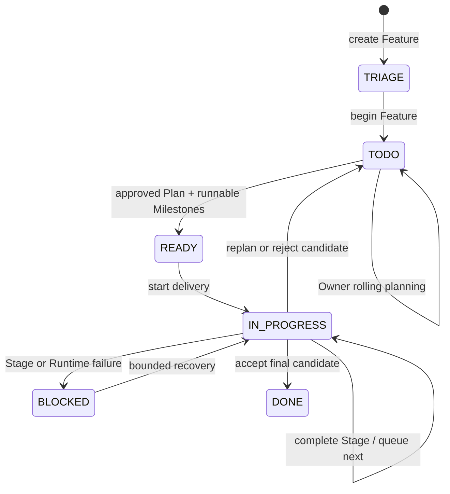
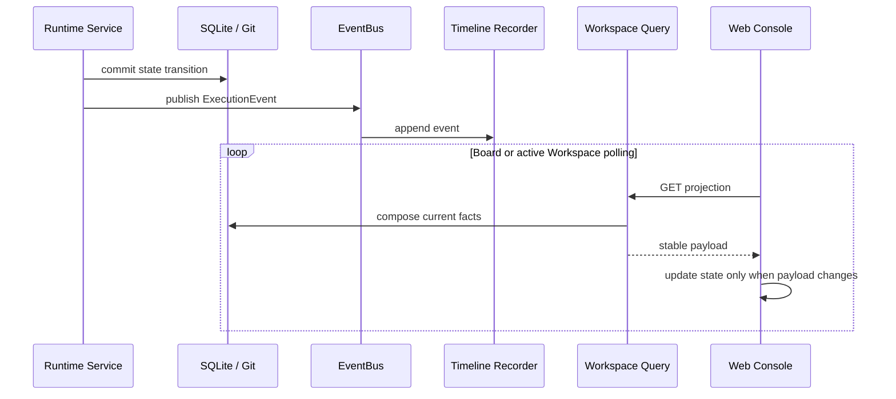
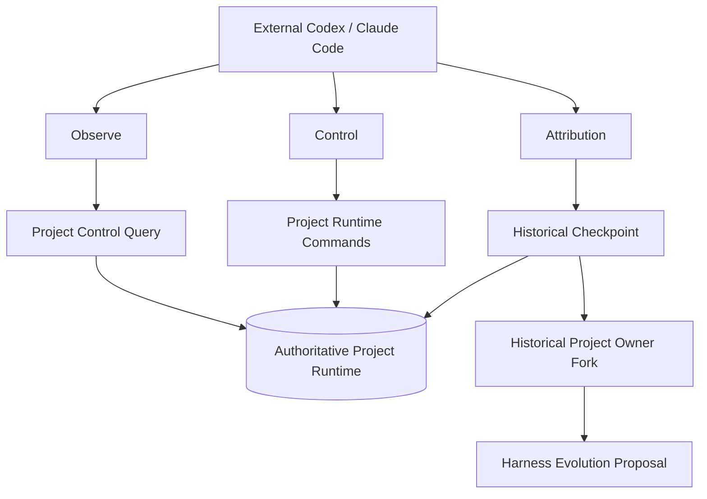

# AgentPanelX 架构

AgentPanelX 是一个面向长周期 Coding Tasks 的本地优先交付运行时。它以 Project Owner 作为用户代理，将目标维护、滚动规划、审查、隔离执行、人工决策与失败归因组织到同一个 Project Runtime 中，并通过 Kanban Console 与 Agent-native Skills 暴露可观察、可介入、可追溯的项目控制面。

## 1. 架构目标

系统围绕四个约束设计：

1. **长期目标不依赖单次对话。** 用户意图、Rolling Summary、Plan、Milestone 与执行历史均可恢复。
2. **规划与执行有明确 Contract。** Project Owner 负责推进，Planner、Reviewer 和 Coding Agent 在固定输入、输出与权限边界内协作。
3. **所有执行都能回到同一现场。** 对话、Tool activity、Stage、Git、Runtime 状态与 Timeline 共同构成 Workspace projection。
4. **失败进入下一轮系统优化。** Observe 恢复事实，Control 推进恢复，Attribution 复盘历史 Project Owner 上下文并形成 Harness Evolution Proposal。

## 2. 系统上下文



Web Console 与外部 Coding Agent 是同一个 Runtime 的两个操作入口：浏览器适合持续观察和人工决策；Skills 让 Codex 或 Claude Code 在终端中读取证据、执行有边界的控制动作，或复盘一次历史失败。

## 3. 运行时分层



### Workspace Service

`WorkspaceService` 管理公开的项目级操作：注册仓库、创建 Feature worktree、读取 Board、组合 Workspace、提交消息、批准或拒绝 Plan、开始和继续 Delivery。它负责把 Web 命令映射为 Project Runtime 的显式方法，不在路由层隐藏业务状态转换。

### Workspace Worker

`WorkspaceWorker` 是单一后台推进器。API 接受命令后只唤醒 Worker；Worker 串行消费所有可自动推进的 Owner Activation 和 Delivery step，避免多个后台线程同时改变同一 Feature。进程启动时，它会先恢复被中断的 Activation，再继续处理可运行任务。

### Project Runtime Service

`ProjectRuntimeService` 是 Project Owner、Planning、Delivery 与查询投影之间的协调边界。它保证：

- 用户 Message 与 `PENDING` Owner Activation 在同一事务内创建；
- 一个 Feature 同时只存在一个未完成 Owner Activation；
- Owner 运行期间不能并发启动 Delivery，Delivery 运行期间不能提交冲突命令；
- Plan 决策、Milestone 更新、Candidate 接受或拒绝均通过 Service Contract 执行；
- Tool 驱动模式与模型驱动模式共享同一 Runtime、持久化和事件链路。

### Project Owner Agent

Project Owner 是长期目标的用户代理。它读取 Message History、Rolling Summary、Project Runtime Context 与当前工作区，通过 ReAct loop 选择 `bash`、`talk_to_agent`、`request_plan_approval`、`update_milestones`、`run_next_milestone` 和 `decide_milestone_candidate` 等 Tool，将一次自然语言目标逐步推进为可审查、可执行、可恢复的交付过程。

## 4. 权威数据与读写边界

AgentPanelX 不使用单个状态对象描述整个项目。不同事实由最适合它的存储负责，再由查询层组合为用户看到的 Workspace。

| 事实 | 权威来源 | 主要写入方 | 前端呈现 |
| --- | --- | --- | --- |
| 用户意图、Owner 回复、Tool activity | SQLite Message History | Project Owner Service | Conversation |
| Owner 运行状态与失败 | SQLite Owner Activation | Activation Driver | Runtime / Conversation |
| Rolling Summary 与 Owner 上下文 | SQLite Context Memory | Owner Context Memory | Owner 下一次激活 |
| Feature 状态、pending action、Plan identity | SQLite Project Runtime Context | Runtime / Planning / Delivery | Board / Runtime |
| Plan 文档与批准版本 | Git working tree + Plan commit | Project Owner / Planning | Plan panel / Git |
| Milestone、Stage 与 Candidate | SQLite snapshot + Git refs | Delivery Service / Runner | Milestones / Runtime / Git |
| 代码变更 | Feature / Stage worktree 与 Git commit | Coding Agent / Stage Executor | Git panel |
| 状态到达路径 | SQLite Timeline | EventBus recorder | Timeline |



SQLite 负责可恢复的运行状态，Git 负责需要版本语义的交付事实。`.agentplanex/` 通过目标仓库的 `.git/info/exclude` 隔离，不进入业务 commit。任何操作都必须经过 Runtime 与 Service；直接修改 SQLite 或 Git ref 不属于受支持的控制路径。

## 5. 核心链路一：从目标到 Project Owner Activation



API 先返回 durable receipt，不等待模型完成。Activation 的 `PENDING → RUNNING → terminal` 状态独立持久化，因此网页可以同时呈现 Owner 正在运行、具体 Tool step、最终回复或失败原因。若 Web 进程在 Activation 运行中退出，重启恢复会将遗留运行标记为明确失败，避免永远停留在 `RUNNING`。

## 6. 核心链路二：滚动规划与 Hard Gate

Project Owner 在 Feature worktree 中维护 `requirements.md`、`architecture.md` 与 `roadmap.md`。Plan Approval 不是一个松散按钮，而是围绕精确 subject identity 的受保护转换。



Subject digest 将“人批准的内容”“Reviewer 审查的内容”和“最终提交的内容”绑定为同一个对象。文档在等待批准期间发生变化、Reviewer 输出不完整、subject 不匹配或审查执行失败时，Hard Gate 拒绝继续推进。

Milestone View 使用相同设计：完整 Milestone 集合与当前 Plan commit 形成固定审查对象，Reviewer 在隔离 workspace 中返回结构化 manifest 和审计 artifact。

## 7. 核心链路三：隔离执行与 Candidate 决策



一次 Worker tick 最多驱动一个 durable Stage，长任务因此可以在多个进程生命周期之间继续。Stage worktree、output commit、candidate ref 和 Runtime Context 相互校验，避免仅凭一段 Agent 文本把任务判定为完成。

## 8. Feature 生命周期



Kanban 状态只是 Project Runtime 的高层投影。`pending_action`、Activation status、Milestone state、Stage run 和 Candidate SHA 提供更细的控制信息，因此一个 `TODO` 卡片仍可能明确显示 `WAITING: PLAN_APPROVAL`。

## 9. EventBus、Timeline 与前端投影

EventBus 是同步的进程内事实分发器。领域服务完成状态转换后发布 `ExecutionEvent`，SQLite Timeline recorder 将其保存为可查询证据。Event handler 的失败会被记录，但不会反转已经成功提交的业务决策。



当前浏览器采用分层静默轮询：Board 使用较低频率，打开的 Workspace 在 Activation 或 Delivery 活跃时提高刷新频率。旧数据在请求期间保持可见，只有 payload 实际变化时才更新 React state，因此不会因轮询反复清空页面。未来若接入 SSE 或 WebSocket，稳定的推送边界仍应是 Workspace projection 或 event cursor，而不是让每个领域服务直接管理浏览器连接。

Workspace projection 一次组合以下信息：

- Project Owner 对话、回复与可展开 Tool activity；
- Runtime status、pending action 与 Activation；
- Plan 文档与审批状态；
- Milestone、Stage、Candidate 与当前交付进度；
- Feature branch、worktree 与 Git commit；
- Timeline 中的状态转换和 Agent invocation。

## 10. Agent-native Skills

三个 Skill 不是三套平行状态，而是同一个 Project Runtime 上的三种操作权限。



### Observe

只读恢复指定 Feature 的 Project Runtime、Message History、Plan、Milestone Snapshot、Stage Run、Git 与 Timeline，回答“项目现在在哪里”和“它如何到达这里”。

### Control

通过真实 Runtime 执行有边界的命令：驱动 Owner Activation、发送消息、批准或拒绝 Plan、开始 Milestone、推进一个 Delivery step。它复用 Web Console 的 Service Contract，不直接写数据库或 Git ref。

### Attribution

以 BLOCKED 检查点为锚点，恢复当时的 Owner Context、Rolling Summary、Plan、Message Store、Milestone 与 Delivery evidence；随后 fork 一个只读 Historical Project Owner，对当时的判断、上下文和协作过程进行质询与反思，最终汇总为 Harness Evolution Proposal。

## 11. Harness Evolution 闭环

```mermaid
flowchart LR
    Delivery[Long-running Delivery]
    Blocked[BLOCKED Checkpoint]
    Evidence[Observe: recover evidence]
    Reflection[Attribution: fork and question Historical Owner]
    Diagnosis[Cross-role diagnosis]
    Proposal[Harness Evolution Proposal]
    Change[Runtime / Prompt / Contract improvement]
    Replay[Future delivery validation]

    Delivery --> Blocked
    Blocked --> Evidence
    Evidence --> Reflection
    Reflection --> Diagnosis
    Diagnosis --> Proposal
    Proposal --> Change
    Change --> Replay
    Replay --> Delivery
```



归因对象不是单条报错，而是 `planning → execution → blocked` 的完整证据链。Proposal 可以定位到规划 Contract、上下文交接、Reviewer 输入、Stage 执行、Runtime 恢复或工程 Harness 的具体缺口，使一次交付失败成为后续交付系统的改进输入。

## 12. 并发、恢复与安全边界

- **串行机器推进：** 一个 Workspace Worker 依次消费自动步骤；Project Runtime 同时拒绝冲突的 Owner 与 Delivery 命令。
- **Durable Activation：** Message 与 Activation 原子创建；重启后不保留无法证明仍在执行的 `RUNNING` 状态。
- **Durable Stage：** Stage claim、输出 commit、Candidate ref 与完成状态分别持久化，允许在边界处恢复。
- **隔离工作区：** Feature、Reviewer 和 Stage 使用独立 worktree 或 workspace，降低并行 Agent 相互覆盖的风险。
- **Fail-closed Hard Gate：** digest、manifest、artifact 或 Reviewer Contract 任一不满足即停止推进。
- **本地优先：** Web host 限制为 `127.0.0.1` 或 `localhost`；模型凭据只从环境变量读取。
- **受限 Shell：** Project Owner Bash 通过 Bubblewrap 限制持久写入范围并创建无网络 namespace；它是本地执行边界，不等同于多租户保密沙箱。
- **受管删除：** 只删除 AgentPanelX 管理且不活跃的 worktree，保留 Git branch，并保护真实项目与运行中 Feature。

## 13. 主要代码入口

| 关注点 | 入口 |
| --- | --- |
| FastAPI 与 SPA host | `src/agentplanex/web/app.py` |
| Workspace commands 与 projection | `src/agentplanex/services/workspace.py`, `workspace_board.py`, `project_workspace.py` |
| 后台推进器 | `src/agentplanex/services/workspace_worker.py` |
| Project Runtime 协调 | `src/agentplanex/services/project_runtime.py` |
| Project Owner 与 Activation | `src/agentplanex/services/project_owner.py`, `owner_activation.py` |
| Context Memory / Rolling Summary | `src/agentplanex/services/owner_context_memory.py`, `owner_context.py` |
| Planning 与 Hard Gate | `src/agentplanex/services/planning.py`, `plan_hard_gate.py` |
| Agent Collaboration | `src/agentplanex/services/agent_collaboration.py`, `agent_contracts.py` |
| Delivery 状态机与 Runner | `src/agentplanex/services/delivery.py`, `delivery_runner.py` |
| Coding Agent Stage 执行 | `src/agentplanex/services/stage_executor.py` |
| EventBus 与 Timeline | `src/agentplanex/services/event_bus.py`, `infrastructure/sqlite/timeline.py` |
| Git / worktree 基础设施 | `src/agentplanex/infrastructure/git_repository.py`, `workspace_git.py`, `agent_workspace.py` |
| React Board / Workspace | `frontend/src/pages/BoardPage.tsx`, `WorkspacePage.tsx` |
| Agent-native Skills | `.codex/skills/agentplanex-project-observe/`, `agentplanex-project-control/`, `agentplanex-project-attribution/` |

## 14. 单端口部署

生产构建由 FastAPI 在同一个端口同时提供 SPA 与 `/api`：

```text
Browser
  ├── GET /, /console, /projects/...  -> React SPA
  └── /api/...                       -> FastAPI Workspace API
```

开发模式下 Vite 提供前端热更新，并把 `/api` 代理到 FastAPI。两种模式共享相同的 React 页面、Workspace schema 与业务 API。
