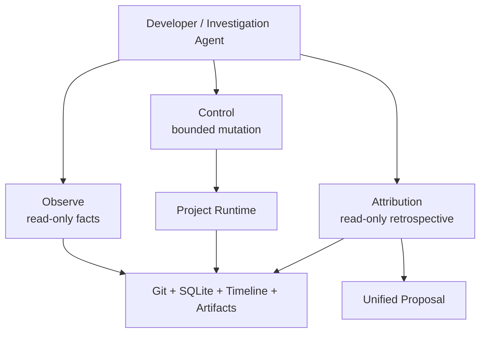

# Agent-Native Operator Kit

AgentPanelX 同时提供面向人的 Web Console 与面向 Agent 的项目级接口。Observe、Control、Attribution 三个 Skill 共享同一个 Project Runtime，但职责和权限不同。



## Observe：观测

Canonical Skill：[`agentplanex-project-observe`](../.codex/skills/agentplanex-project-observe/SKILL.md)

- **什么时候使用**：理解项目当前状态、定位 Triage、核对 Plan / Hard Gate artifact、Stage / Candidate / Git ref，或解释项目如何到达当前状态。
- **输入**：明确的项目目录以及 Feature / Triage 范围。
- **动作**：读取 Runtime projection、SQLite 与 Git 证据，沿 Timeline 还原因果顺序。
- **输出**：带来源的事实摘要、缺失证据和下一步可验证入口。
- **边界**：只读；不 approve、不 drive、不修改数据库或 Git ref。

## Control：介入

Canonical Skill：[`agentplanex-project-control`](../.codex/skills/agentplanex-project-control/SKILL.md)

- **什么时候使用**：在不启动 Project Owner 模型的情况下，手动驱动 Activation、发送 message、approve / reject Plan、start 或 drive Delivery，或逐步验证 Tool 副作用。
- **输入**：用户已授权的真实项目、精确动作和必要参数。
- **动作**：调用 `scripts/debug_tool_cli.py` 和真实 Project Runtime / Service / Execution。
- **输出**：结构化 Tool result，以及可核对的 Git、文件系统和 SQLite 副作用。
- **边界**：不直接写 SQLite，不直接修改 Git ref，不操作未经授权的项目，不代替事后归因。

示例：

```bash
uv run python scripts/debug_tool_cli.py \
  --cwd .agentplanex/tests/<case> \
  --print \
  '{"tool":"request_plan_approval","arguments":{}}'
```

## Attribution：归因

Canonical Skill：[`agentplanex-project-attribution`](../.codex/skills/agentplanex-project-attribution/SKILL.md)

- **什么时候使用**：项目已经进入 BLOCKED / broken，需要解释为什么、质询 Historical Owner，或判断 Planner / Reviewer / Executor / Runtime 的协作缺口。
- **输入**：明确的 Block Incident、历史 Owner / Plan / Message Store / Milestone Snapshot / Delivery 上下文。
- **动作**：先恢复 BLOCKED 时刻的权威证据与上下文水位，再在对应检查点 fork 只读 Historical Project Owner，通过完整反思与后续追问还原当时为何作出这些判断，并区分产品需求、工程实现、模型、Harness 与上下文交接问题。
- **输出**：Historical Owner 的反思与追问记录，以及统一根因、证据引用、反事实检查和结构化 Harness Evolution Proposal。
- **边界**：不解除阻塞，不修改 Runtime，不把猜测写成事实。

## 为什么不合并成一个 Skill

三个 Skill 的分离不是命名包装，而是权限设计：

| 问题 | 应使用 | 原因 |
| --- | --- | --- |
| “现在到底发生了什么？” | Observe | 先建立只读事实 |
| “请批准这个 Plan 并推进一步” | Control | 需要明确授权的真实副作用 |
| “为什么会 BLOCKED，系统该怎么改？” | Attribution | 需要历史回放与整体 Proposal |

典型顺序是 Observe → Control 或 Observe → Attribution；Attribution 产生的 Proposal 是否应用，仍需进入新的规划与交付 Contract。

## Skill 与 Web Console 的映射

| Web Console 区域 | Skill 看到的权威对象 |
| --- | --- |
| Board status / pending action | Project Runtime Context |
| Project Owner 对话 | Message History + Owner Activation |
| Tool Step | ReAct / Tool execution evidence |
| Plan | versioned spec documents + plan commit |
| Milestone / Stage | Milestone Snapshot + Stage Run |
| Git | managed branch / worktree / candidate |
| Timeline | ordered ExecutionEvent |

因此网页和 Skill 不是两套状态：它们只是面向人和面向 Agent 的两个访问面。
