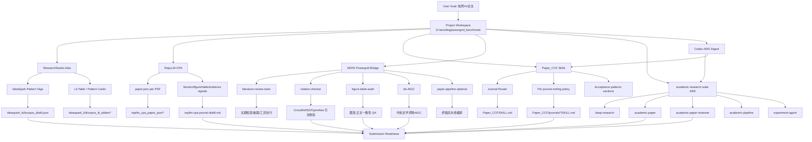

# Capability Graph

## 读图说明

- 左侧是「能力入口」，中间是「运行产物」，右侧是「投稿就绪能力」。
- `ResearchStudio-Idea` 负责“方法/创新模式蒸馏”。
- `RepLLM-CPA` 负责“结构化证据蒸馏（章节-图表-实验信号）”。
- `Paper_CCF` 负责“目标期刊决策与写作约束”。
- `academic-research-suite` 负责“研究→写作→审稿流程（ARS）”。
- `Codex-ARS Digest` 负责“姿势手册 + 电网 playbook”。
- `AERS-Bridge` 负责“投稿前质量闸门工具链”。
