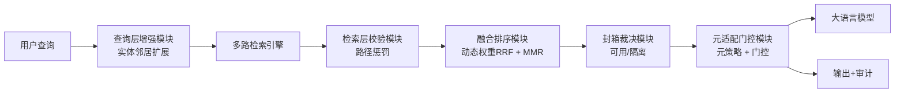
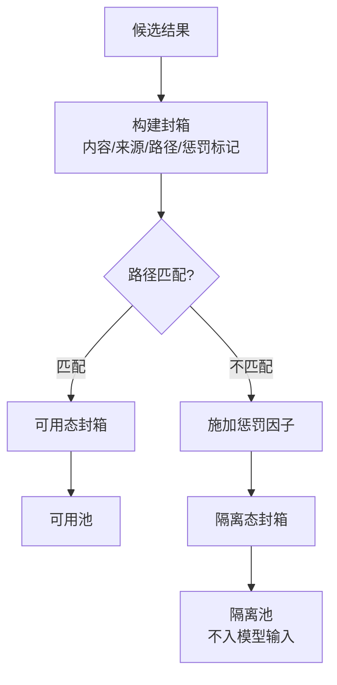
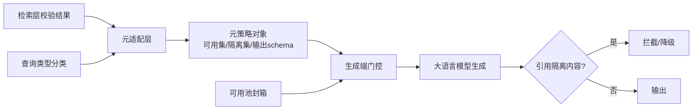
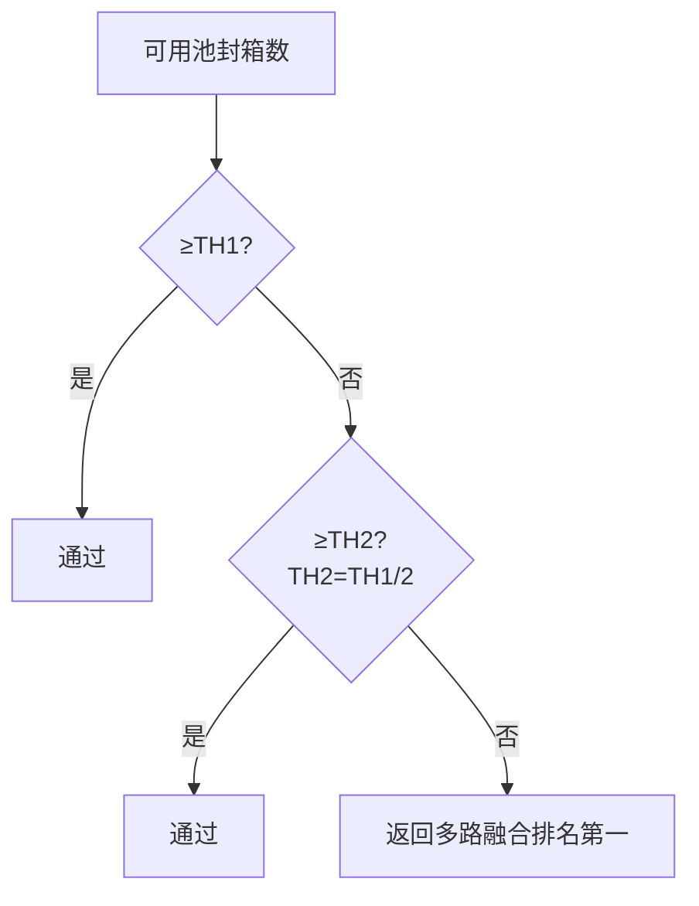

# 附图清单与描述

| 图号 | 图名 | 对应实施例 | 摘要附图 |
|---|---|---|---|
| 图1 | 系统总体架构（Seal-and-Adapt 闭环） | 实施例一 | ✓ |
| 图2 | 封箱构建与裁决流程 | 实施例一 | |
| 图3 | 元适配层与生成端门控关系 | 实施例一 | |
| 图4 | 三级安全网降级路径 | 实施例二 | |

## 图1：系统总体架构（Mermaid）

## 图2：封箱构建与裁决流程（Mermaid）

## 图3：元适配层与生成端门控关系（Mermaid）

## 图4：三级安全网降级路径（Mermaid）

## 标号体系

- 100 系列：系统模块（101 查询层 / 102 检索层 / 103 封箱裁决 / 104 元门控 / 105 生成端）
- 200 系列：封箱字段（201 内容 / 202 来源 / 203 路径 / 204 惩罚 / 205 一致性）
- 300 系列：元策略对象（301 可用集 / 302 隔离集 / 303 输出schema）